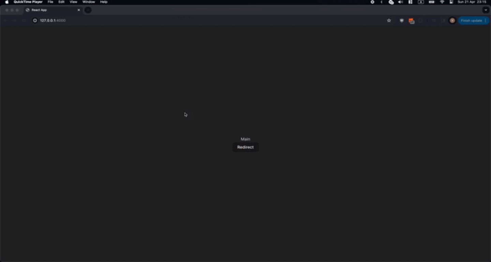

# Simple React Router

Make simple navigation to add basic navigation in React application.

## Example

Defining in root application file routers.

```tsx
function App() {
  return (
    <NavigatorProvider
      onScreenChange={(...args) => {
        console.log(args);
      }}
      fallbackRouteName="main"
    >
      <NavigatorScreen
        name="home"
        component={Home}
        props={{
          internalName: "HomeScreen",
        }}
      />
      <NavigatorScreen name="main" component={Main} />
    </NavigatorProvider>
  );
}
```

| PropName            | Description                                                    | Return value                                         |
| ------------------- | -------------------------------------------------------------- | ---------------------------------------------------- |
| `onScreenChange`    | If you need to be updated on change in navigation.             | `{currScreenName: string; prevScreenName: string; }` |
| `fallbackRouteName` | Initial screen. Default the first screen in stack declaration. |                                                      |

Need to navigate.

```tsx
function Main() {
  const { goNextTo } = useContext(NavigatorContext);

  return (
    <div>
      <div>Main</div>
      <button
        onClick={() => {
          goNextTo("home");
        }}
      >
        Redirect
      </button>
    </div>
  );
}
```

| PropName   | Description                                                    | Return value |
| ---------- | -------------------------------------------------------------- | ------------ |
| `goNextTo` | Navigate to router by passing name                             |
| `goBack`   | Navigate back. Default nothing happens if no previous in stack |
| `reset`    | Navigate on first router in stack                              |

## Demo


